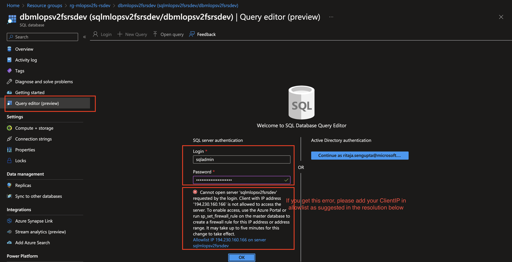
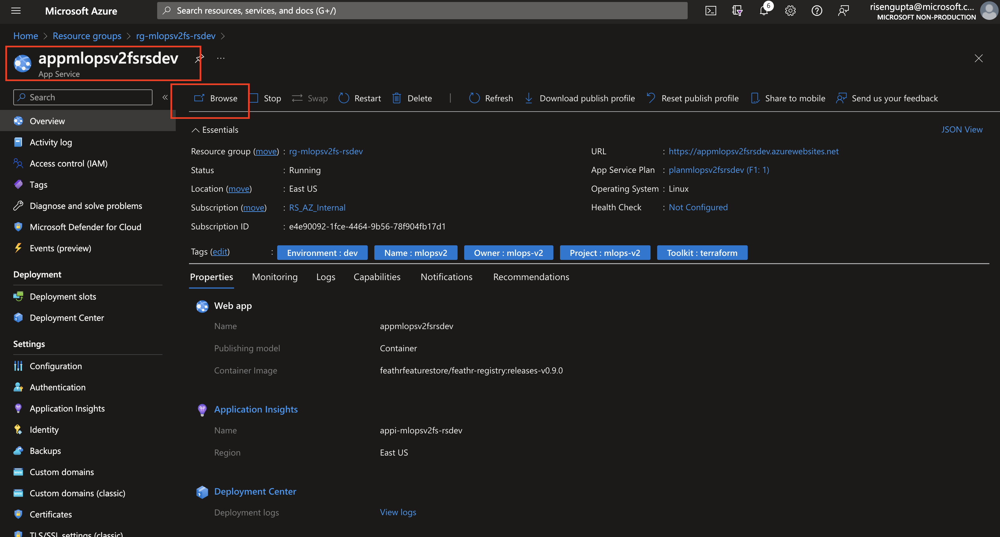
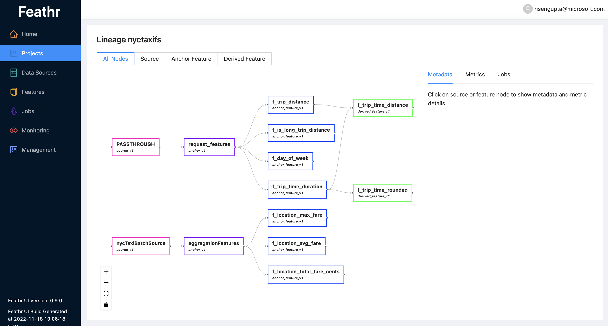
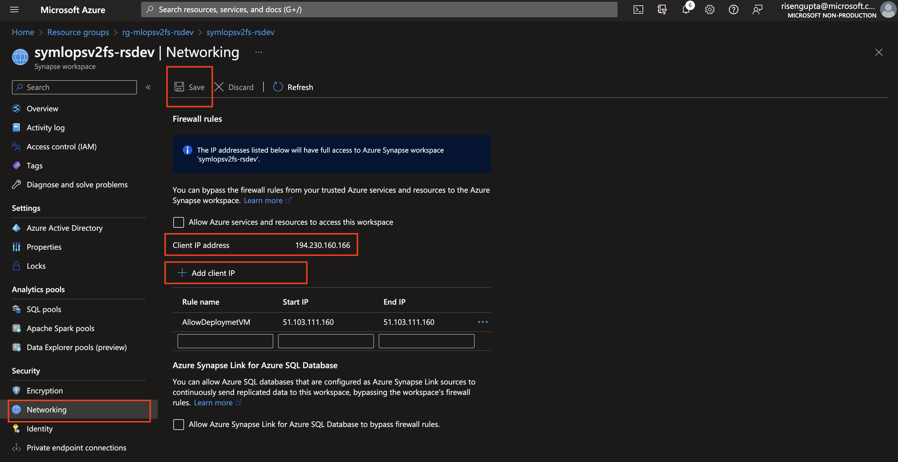
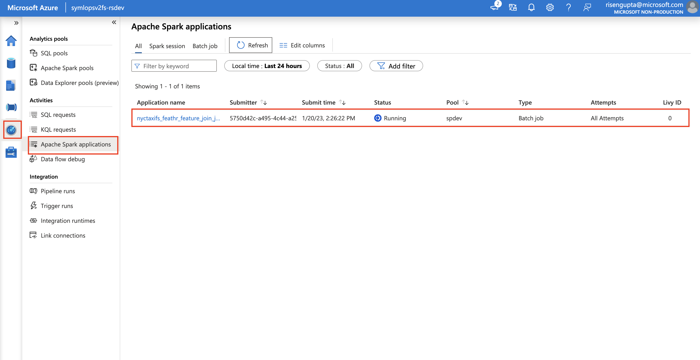

## Create the necessary environment

- Make sure you have conda/miniconda installed on your machine

- Create a new conda environment and activate it

```bash
conda create -f environment.yml
conda activate datascience-env
```

## Upload data

- navigate to the `data` folder in this repo and locate the `nyc_taxi.parquet` file

- Navigate to Azure Portal and open the storage account you created in the previous step(s) for the feature store

- Click on "Container" and then click on "+ Container", name the container `nyctaxi` and upload the data `nyc_taxi.parquet` file to this new container

## Run the notebook and configurations along the way
- A notebook is provided in this folder to help you get started with the feature store. Open the notebook and follow the instructions in the notebook to get started. THe notebook is named `nyc_driver_mlops.ipynb`, while you follow the steps in the notebook, please refer back to this readme for additional instructions on steps you need to take in the portal.

- The Feathr config file is provided in this folder as well, it is named `feathr_config.yml`. You will not need to change the values in this file, most of the required parameters for this exercise will be set from the notebook as environment variables.

- After you have executed the feature registry step, before we can track lineage from the app, we need to add ourselves as a user to the feature store. To do this, navigate to the resource group containing feature store components (remember, the resource group name should be of format: `rg-{prefix}-{postfix}{env}` should have "fs" added to your configured `prefix`), look for the sql database (not the server), click and navigate to it. From the left hand menu, click on "Query editor" and run the following query:

(You need to connect/login to the query editor using the credentials (username and password) you used in your `config-infra-dev/prod.yml` file. The variables to look for are `sql_admin_user` and `sql_admin_password`. )



```sql
insert into userroles (project_name, user_name, role_name, create_by, create_reason, create_time) values ('global', '[your-email-account]','admin', '[your-email-account]', 'Initialize First Global Admin',  getutcdate())
```
replace `[your-email-account]` with your email account.

After this from the same feature store resource group navigate to the feathr app and click on browse to navigate to the UI (accept when the AAD app asks permissions):



Now you should be able to see the feature store UI and you should be able to see the feature registry you created in the notebook. You can also see the lineage of the feature registry you created in the notebook:



- Before you execute the "Create training data..." step, you need to make sure that your clientIP is added to Synapse and allowed to interract with it. navigate to the feature store resource group and look for the Synapse workspace. Click on the workspace and navigate to the "Networking" tab. Click on "Add client IP" and add your client IP to the list of allowed IPs. This will allow you to interact with Synapse from your machine:



Now go back to the notebook and execute this step, you can track the spark application run, by navigating to the Synapse workspace and clicking on "Monitor" and then "Apache Spark applications":




